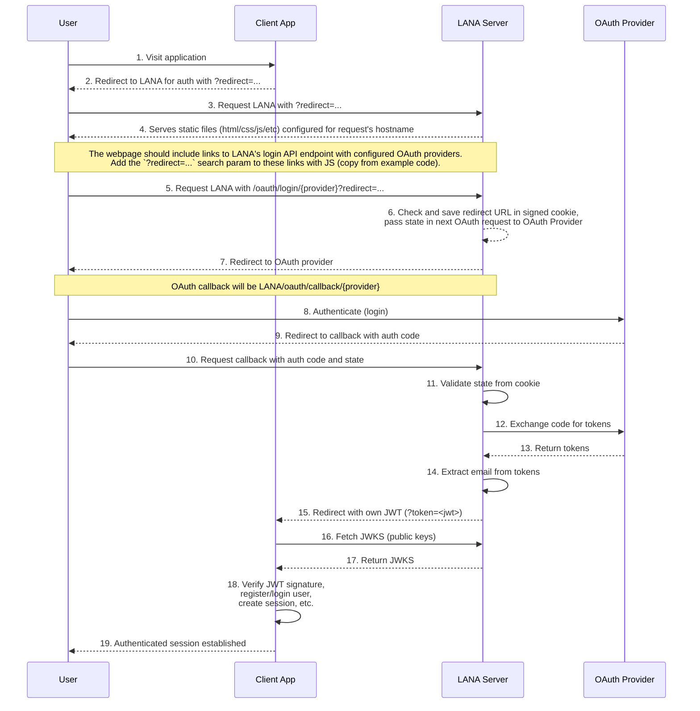

<p align="center">
  
</p>

<h1 align="center">LANA</h1>
<p align="center"><b>L</b>ightweight <b>A</b>uthe<b>N</b>tication <b>A</b>pp</p>
<p align="center">A single OAuth 2.0 SSO server to simplify authentication for multiple applications.</p>

Lana provides OAuth 2.0 authentication through multiple providers (Google, Facebook, and more to come) and issues JWTs for authenticated users. The server supports multi-host configurations with host-specific JWT signing keys and provider settings, making it ideal for managing authentication across multiple applications from a single deployment.

## Authentication Flow



## Features

- **Multi-Provider OAuth 2.0** - Built-in support for Google (with OIDC) and Facebook OAuth, with a pluggable provider architecture for easy extension
- **JWT Token Generation** - Issues signed JWTs with RSA-256 using host-specific private keys
- **JWKS Endpoint** - Exposes public keys at `/.well-known/jwks.json` for downstream JWT verification
- **Multi-Host Support** - Single server instance can handle multiple hosts with different configurations, JWT keys, and OAuth providers
- **Rate Limiting** - Per-IP rate limiting with token bucket algorithm, proxy-aware with multi-header IP detection (CF-Connecting-IP, X-Real-IP, X-Forwarded-For)
- **CSRF Protection** - Encrypted state cookies using AES-GCM prevent cross-site request forgery attacks
- **Prometheus Metrics** - Built-in metrics for HTTP requests, authentication attempts, and request duration
- **Wildcard Redirect URLs** - Support for wildcard patterns in allowed redirect URLs for flexible client configuration
- **Environment Variable Substitution** - Configuration supports `$VAR_NAME` syntax for secrets and environment-specific values

## Security

Lana is built with security as a top priority:

- **RSA-256 JWT Signing** - Industry-standard asymmetric signing using PKCS#1 PEM format
- **AES-GCM Cookie Encryption** - State cookies encrypted with AES-256-GCM for CSRF protection
- **OIDC Support** - Full OpenID Connect implementation for Google OAuth with ID token verification
- **Email Verification** - Validates email verification status for OAuth providers (e.g., Google)
- **Secure Cookie Flags** - HttpOnly, Secure, and SameSite flags prevent cookie theft and CSRF
- **Rate Limiting** - Token bucket algorithm prevents brute force and DoS attacks
- **Proxy-Aware IP Detection** - Supports X-Forwarded-For, CF-Connecting-IP, and X-Real-IP headers with priority-based detection
- **Context-Aware Timeouts** - All OAuth operations have 10-second timeouts with configured HTTP client limits
- **Minimal Attack Surface** - Docker image built from scratch with only essential binaries
- **Non-Root Execution** - Docker container runs as user `65534:65534` (nobody)

## Configuration

The server is configured via `config.yaml` with support for environment variable substitution using `$VAR_NAME` syntax.

Lana supports multiple hosts from a single deployment. Each host can have:
- **Unique JWT signing keys** - Different RSA key pairs per domain
- **Different OAuth providers** - Enable Google for one host, Facebook for another
- **Separate login pages** - Custom branding per domain
- **Individual JWT settings** - Different audiences, expiry times, and key IDs

### Configuration Example

**Minimal configuration** (using defaults):

```yaml
# Only required field at top level
cookie:
  secret: $COOKIE_SECRET  # Must be 32+ characters for AES-256

# Host configuration (at least one required)
hosts:
  auth.example.com:
    login_dir: ./web/example/
    allowed_redirect_urls:
      - "https://app.example.com/*"
      - "http://localhost:*/*"  # For development
    jwt:
      private_key_file: "./keys/example.pem"
      kid: "example-key-2025-01"
      audience: "https://app.example.com"
      expiry: "2h"
    providers:
      google:
        client_id: $GOOGLE_CLIENT_ID
        client_secret: $GOOGLE_CLIENT_SECRET
```

**Full configuration** (with all options):

```yaml
# Environment: development or production (default: production)
env: production

# Server settings (default port: 8080)
server:
  port: 8080

# Cookie configuration (default name: oauth_state)
cookie:
  name: "oauth_state"
  secret: $COOKIE_SECRET  # Must be 32+ characters for AES-256

# Rate limiting (defaults: 60 req/min, 5m cleanup, index 0)
ratelimit:
  requests_per_minute: 60
  cleanup_interval: "5m"
  x_forwarded_for_index: 0  # 0 = original client, -1 = closest proxy

# Logging (defaults: info level, text format)
logging:
  level: "info"  # debug, info, warn, error
  format: "json"  # json, text

# Metrics - Prometheus (optional, disabled by default)
metrics:
  enable: true
  go_metrics: false
  path: "/metrics"

# Multi-host configuration
hosts:
  auth.example.com:
    login_dir: ./web/example/
    allowed_redirect_urls:   # Wildcard patterns supported
      - "https://app.example.com/*"
      - "https://admin.example.com/*"
      - "http://localhost:*/*"  # For development
    jwt:
      private_key_file: "./keys/example.pem"
      kid: "example-key-2025-01"
      audience: "https://app.example.com"
      expiry: "2h"
    providers:
      google:
        client_id: $EXAMPLE_GOOGLE_CLIENT_ID
        client_secret: $EXAMPLE_GOOGLE_CLIENT_SECRET

  auth.anotherapp.com:
    login_dir: ./web/anotherapp/
    allowed_redirect_urls:
      - "https://anotherapp.com/*"
      - "https://*.anotherapp.com/*"
    jwt:
      private_key_file: "./keys/anotherapp.pem"
      kid: "anotherapp-key-2025-01"
      audience: "https://anotherapp.com"
      expiry: "1h"
    providers:
      facebook:
        client_id: $ANOTHERAPP_FB_CLIENT_ID
        client_secret: $ANOTHERAPP_FB_CLIENT_SECRET
```

### Configuration Options Reference

| Field | Type | Required | Default | Description |
|-------|------|----------|---------|-------------|
| `env` | string | No | `"production"` | Environment mode: `development` or `production` |
| `server.port` | int | No | `"8080"` | HTTP port to listen on |
| `cookie.name` | string | No | `"oauth_state"` | Cookie name for OAuth state storage |
| `cookie.secret` | string | Yes | - | 32+ character secret for AES-256 encryption |
| `ratelimit.requests_per_minute` | int | No | `60` | Max requests per IP per minute |
| `ratelimit.cleanup_interval` | duration | No | `"5m"` | How often to clean expired entries |
| `ratelimit.x_forwarded_for_index` | int | No | `0` | Which IP to use from X-Forwarded-For (0-based, -1 for rightmost) |
| `logging.level` | string | No | `"info"` | Log level: `debug`, `info`, `warn`, `error` |
| `logging.format` | string | No | `"text"` | Log format: `json` or `text` |
| `metrics.enable` | bool | No | `false` | Enable Prometheus metrics endpoint (entire `metrics` section is optional) |
| `metrics.go_metrics` | bool | No | `false` | Include Go runtime metrics (memory, goroutines, GC) |
| `metrics.path` | string | No | `"/metrics"` | Metrics endpoint path |
| `hosts.<hostname>.login_dir` | string | Yes | - | Path to login page directory |
| `hosts.<hostname>.allowed_redirect_urls` | []string | Yes | - | List of allowed redirect URLs (supports wildcards: `*`) |
| `hosts.<hostname>.jwt.private_key_file` | string | Yes | - | Path to RSA private key (PEM format) |
| `hosts.<hostname>.jwt.kid` | string | Yes | - | Key ID for JWT header |
| `hosts.<hostname>.jwt.audience` | string | Yes | - | JWT audience claim (aud) |
| `hosts.<hostname>.jwt.expiry` | duration | Yes | - | JWT expiration time (e.g., "1h", "30m") |
| `hosts.<hostname>.providers.<name>.client_id` | string | Yes | - | OAuth provider client/app ID |
| `hosts.<hostname>.providers.<name>.client_secret` | string | Yes | - | OAuth provider client/app secret |

Variables are substituted at server startup using `$VAR_NAME` syntax. If a variable is missing, the server will fail to start with a clear error message.

## Client Integration

To integrate Lana with your application:

1. **Redirect users to Lana** for authentication:
   ```
   https://auth.yourapp.com/oauth/login/google?redirect=https://yourapp.com/callback
   ```

2. **Handle the callback** with the JWT token:
   ```
   https://yourapp.com/callback?token=<jwt>
   ```

3. **Verify the JWT** using the public key from `/.well-known/jwks.json`

For a complete working example of a client application that integrates with Lana, see [example/README.md](example/README.md).

The example demonstrates:
- JWT verification using JWKS
- Secure session management
- User profile display
- Logout handling

## License

Apache License 2.0

See [LICENSE](LICENSE) for details.
